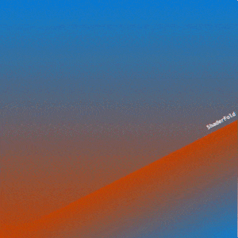

# ***ShaderFold***

> Boilerplate Defold shader for porting ShaderToy code.

-----



-----

## **Notes**

This is a basic Defold project template for porting ShaderToy shaders.  
To learn how to port ShaderToy code to Defold, check out the [Official Defold ShaderToy Tutorial](https://defold.com/tutorials/shadertoy/).  
See [DefFX](https://github.com/subsoap/deffx), [Defold Shader Examples](https://github.com/subsoap/defold-shader-examples), [Defold Shaders](https://github.com/subsoap/defold-shaders), [DefFragments](https://github.com/paweljarosz/defragments), [Pixel Planets](https://github.com/selimanac/defold-pixel-planets), and [Glitch Defold](https://github.com/TheKing009/glitch-defold) for Defold-specific shaders implemented with best practices.

The goal of this project is to provide a template for porting and playing with code, not reimplement every ShaderToy input.

This is in development, not well tested, and suffers issues. Many shaders require fine tuning for resolution and input parity. Feel free to [open an issue](https://github.com/trainingmode/ShaderFold/issues/new) for any problems you encounter or improvements.

-----

## **Supported Features**

- iResolution  
- iTime  
- iTimeDelta  
- iFrame  
- iMouse  
- iChannel0

-----

## **Installation**

*TO DO...*

-----

## **Quick Start**

Please see the [shader.fp](shaders/shader.fp) Fragment Program for a basic implementation.  
Ensure all Fragment Constants are used (ex: `vec4 mouse = iMouse;`), otherwise Defold will throw errors.

### *Material*

The [shader.material](defold://open?path=/shaders/shader.material) defines constants used by the shader.  
Texture Samplers defined within the Material will automatically appear in the Model's properties.

### *Model*

The shader renders onto the `shader_model` Model Component within the `ShaderFold` GameObject in the [main.collection](defold://open?path=/main/main.collection).

### *Script*

Updates to shader constants are pushed from the [fold.script](main/fold.script) Script Component within the `ShaderFold` GameObject in the [main.collection](defold://open?path=/main/main.collection).

1. Set the `Mesh Size` as the size, in pixels, of the `shader_model` mesh. The default mesh is the built-in 2x2 quad.

2. Set the `Use Ratio` flag to define the `iResolution` behaviour. If true, `iResolution` will use size ratios (ex: `(1.78, 1.)`), otherwise uses the scaled mesh size, in pixels (ex: `mesh_size.xy * go_scale.xy`).

-----

## **API**

### Fragment Constants

## iTimeFrame `vector4`

- [***x***] `iTime` The total time, in seconds.

- [***y***] `iTimeDelta` The time elapsed since the previous frame, in seconds.

- [***z***] `iFrame` The frame count.

- [***w***] `unused`

    ```lua
    time = iTimeFrame.x;
    timeDelta = iTimeFrame.y;
    frame = iTimeFrame.z;
    ```

## iResolution `vector4`

- [***x***] `iResolution.x` The `ShaderFold` GameObject width, in pixels. If `Use Ratio` is set, outputs as the width ratio.

- [***y***] `iResolution.y` The `ShaderFold` GameObject height, in pixels. If `Use Ratio` is set, outputs as the height ratio.

- [***z***] `unused`

- [***w***] `unused`

    ```lua
    resolution = iResolution.xy;
    ```

## iMouse `vector4`

- [***x***] `iMouse.x` The current Mouse x-position, if the Mouse Button is held.

- [***y***] `iMouse.y` The current Mouse y-position, if the Mouse Button is held.

- [***z***] `iMouse.z` Contains both the Mouse Click y-position and the Mouse Down state.

    - `sign(iMouse.z)` The Mouse Down state.

    - `abs(iMouse.z)` The Mouse Click y-position.

- [***w***] `iMouse.w` Contains both the Mouse Click x-position and the Mouse Click state. ShaderToy Click = Defold `action.pressed`.

    - `sign(iMouse.w)` The Mouse Click state.

    - `abs(iMouse.w)` The Mouse Click x-position.

    ```lua
    if (sign(iMouse.w) > 0.) color.rg *= abs(iMouse.wz) / iResolution.x;
    ```

### I/O

## var_texcoord0 `vector2`

- [***xy***] `in fragCoord` The input fragment position. Supplied to the Fragment Program by the Vertex Program.

    ```lua
    vec2 uv = var_texcoord0.xy * iResolution.xy - 0.5
    ```

## gl_FragColor `vector4`

- `out fragColor` The output fragment color.

- [***x***] `red` The output red channel value.

- [***y***] `green` The output green channel value.

- [***z***] `blue` The output blue channel value.

- [***w***] `alpha` The output color transparency.

    ```lua
    gl_FragColor = sampler2D(iChannel0, uv);
    ```

-----

## Credits

ShaderFold `iMouse` is based on [Input - Mouse](https://www.shadertoy.com/view/Mss3zH) by [iq (Inigo Quilez)](https://www.iquilezles.org/) and [tuto: new mouse events](https://www.shadertoy.com/view/3dcBRS) by [FabriceNeyret2](http://evasion.imag.fr/Membres/Fabrice.Neyret/).
